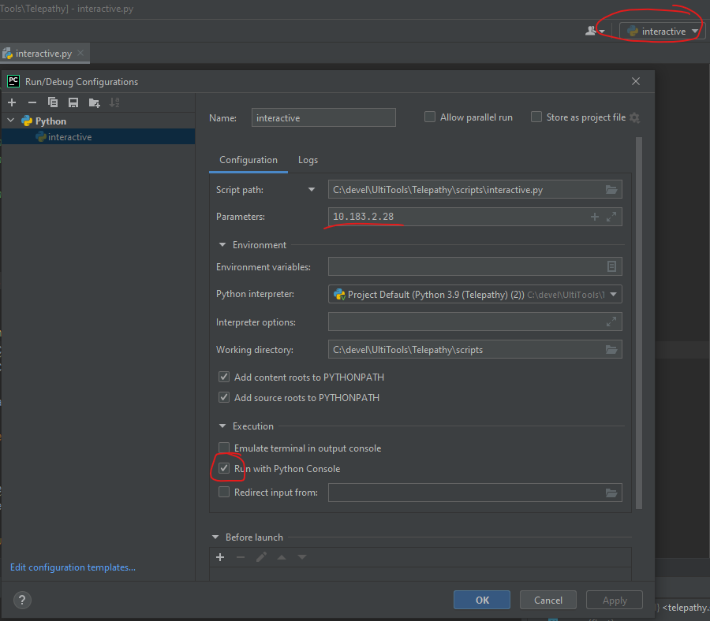

## Setting up PyCharm & using Telepathy/XCP for remote monitoring & interaction with the RT Simulink code

Open pycharm and open the the Telepathy folder. First install the required packages:
```
Settings -> Project: Telepath -> Python Interpreter
```

Add the following packages:

```shell
PyQt5
PyQt5-Qt5
pyqtgraph
pyelftools
pyserial
ipython
```


After this navitage to:
```
Settings -> Build, Execution, Deployment -> Console -> Python Console
```
And add the following line in the Starting Script region:

```python
get_ipython().magic("gui qt")
```

### Running the scripts

After installing all the requirements we can now run our scripts. For each scripts some arguments are required. The arguments can be set in pycharm in the Run/Debug Configurations. (Access via the dropdown next to the run button, and click edit configurations).
For e.g. the scripts/interactive.py script, set the first parameter to the printer ip address.

In this same window, also enable ' Run with Python Console' to enable interaction while the script is running.




Congratulations! You can now run the script :)

