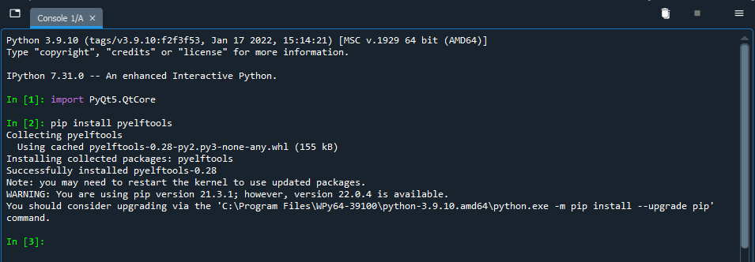
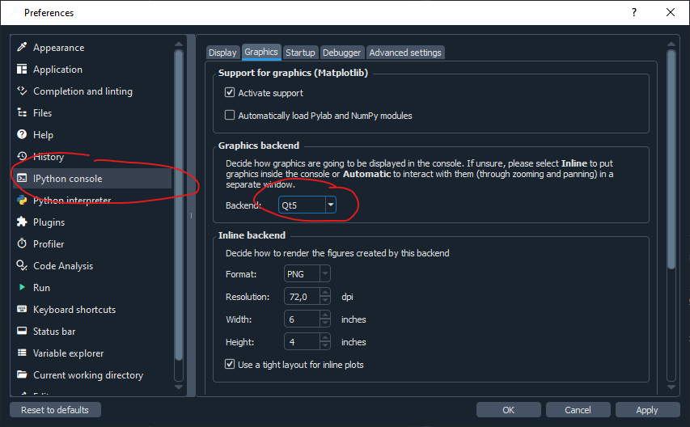
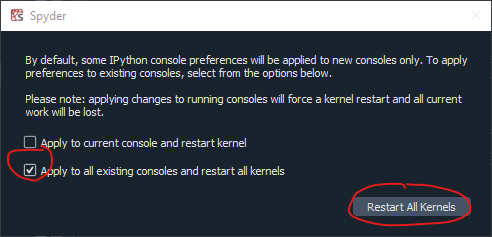
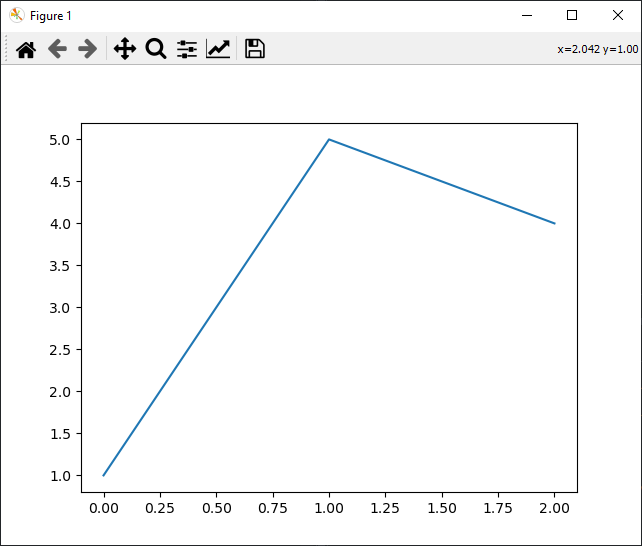
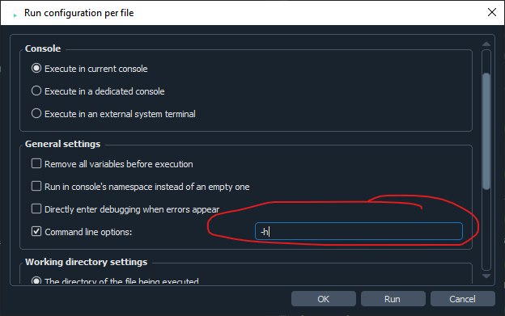

# Setting up Spyder & using Telepathy/XCP for remote monitoring & interaction with the RT Simulink code

## Installing and setting up Spyder
### Installing Python & Spyder
This howto requires Python and Spyder (an interactive development environment). If these are not yet installed on your system, install them first. 

#### Windows
On Windows, install the WinPython distribution which contains Python and the Spyder IDE: [WinPython](https://winpython.github.io/)
This howto was done using WinPython64 3.9.10.0: [Direct link](https://github.com/winpython/winpython/releases/download/4.6.20220116/Winpython64-3.9.10.0.exe). Note that 3.10.2.0 was found not to work out-of-the-box correctly due to a PyQt5 incompatibility.

The installer is a self-extracting executable. **If you want to install in a privileged location (e.g. “C:\Program Files”), extract it first to e.g. you Desktop and only then copy it to the desired location**. Otherwise required locations (the settings folder) are not properly writable. Of course you can also opt to place it in a non-privileged location.

#### Linux
On Linux you can use your package manager (apt install spyder), 

If you get the error
```
Traceback (most recent call last):
  File "/usr/lib/python3/dist-packages/qtpy/QtWebEngineWidgets.py", line 22, in <module>
    from PyQt5.QtWebEngineWidgets import QWebEnginePage
ModuleNotFoundError: No module named 'PyQt5.QtWebEngineWidgets'
```

Make sure to install pyqtwebengine using pip.


### Installing required dependencies
From the extracted location, run 'Spyder.exe'. 

In the Python console, type:


```
pip install PyQt5 pyelftool
```

 

## Configuring Spyder
From the Spyder menu, select Tools → Preferences. 

Select 'IPython console', then in the Graphics tab set 'Backend' to 'Qt5'. This enables interactive graphs.


Then, in the Startup tab, put the following line in the ‘Run code’ field:

```
get_ipython().magic("gui qt")
```

This enables one to keep entering new commands while the logging or plotting application which we will use is running.


Click OK, then select 'Apply to all existing consoles and restart all kernels' and click 'Restart All Kernels'. If this option doesn’t show, manually close the console and restart it.



To check that everything is in working order, type the following two lines in the console:

```
import matplotlib.pyplot as plt
plt.plot([1,5,4])
```

Which should result in a new window (which may appear behind Spyder on the background) showing a graph:


## Installing Telepathy
Download the latest [Telepathy from Github](https://github.com/Ultimaker/Telepathy/archive/refs/heads/master.zip) and extract the zip file to a temporary location.

Open setup.py in Spyder and run in (F5), to install it to your local Python installation. You can remove the zip file. You may want to keep the unzipped folder since the /scripts subfolder contains several scripts which are useful by themselves or as an example for your own measurements.

## Running the Telepathy included scripts from Spyder

Telepathy contains a number of scripts for plotting and/or logging several aspects of the printer. These can be used as-is or as an example/template. Most of them require command-line arguments to specify e.g. the IP-address or hostname of the printer to connect to. This is done in Spyder as follows:

- Open a script e.g. scripts/interactive.py
- Go to Run->Run configuration per file
- Fill in the command line arguments in the 'Command line options' field. E.g. '-h' to get a list of possible options or '10.183.3.229' (without quotes) to specify the IP address of the printer
  
- Click Run (or click OK and run at a later time)

Any subsequent invokations of this file (F5 = run) will use the same command line arguments.